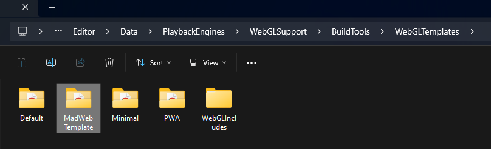
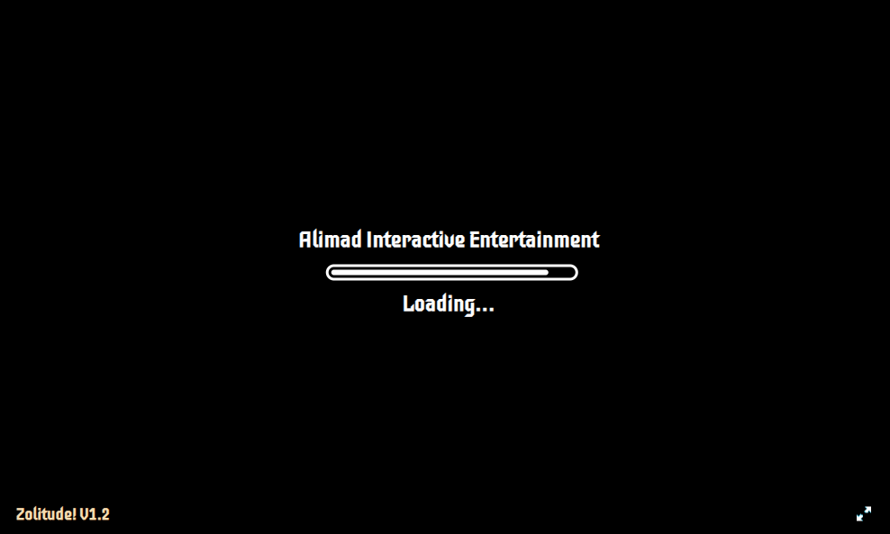
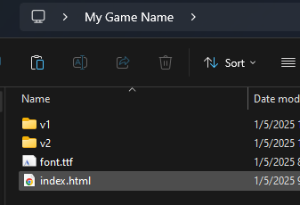

# Some tools to improve your unity web builds!

---

## Unity Web Build Tools

[Video Tutorial](https://www.youtube.com/watch?v=vv8LwzHYqEw)
---

## How to Install MadWeb Template

<details>
  <summary><b>Step 1: Copy the "MadWeb Template" folder into .../Unity Hub\Editor\YourUnityVersion\Editor\Data\PlaybackEngines\WebGLSupport\BuildTools\WebGLTemplates</b></summary>
  
  Copy the "MadWeb Template" folder present in the download.  
  [Locate your unity editor install location.](https://docs.unity3d.com/2018.2/Documentation/Manual/GettingStartedInstallingHub.html#:~:text=of%20the%20Hub.-,Click%20the%20Installs%20tab.,and%20select%20the%20Unity%20executable.)  
  Open "Editor\YourUnityVersion\Editor\Data\PlaybackEngines\WebGLSupport\BuildTools\WebGLTemplates" folder.  
  Paste the "MadWeb Template" folder there.  
  
</details>

<details>
  <summary><b> Step 2: Select MadWeb Template in Project Settings > Player > Resolution and Presentation</b></summary>
  
  [View detailed info here.](https://docs.unity3d.com/Manual/web-templates-intro.html)  
  
</details>

<details>
  <summary><b> Step 3: Export a Web Build</b></summary>
  
  Do you really need a summary for this??  
  
</details>

<details>
  <summary><b> Customization</b></summary>

  -  ** Change the font by replacing `TemplateData/font.ttf` **   
    Make sure to replace with the same name.

  -  ** Change loading subtitles by editing `TemplateData/subtitles.txt` **   
    Format:  
    ```
    50%:Half Done  
    70%: More than half Done  
    ```

  .png)  
  .png)
</details>

---

## How to use Multi Web Builds

<details>
  <summary><b> Step 1: Make a copy of "Multi Web Build" folder and rename it to whatever you want.</b></summary>
  
  Copy it somewhere outside of this downloads folder.  
  
</details>

<details>
  <summary><b> Step 2: Paste the contents of your first web build into the "v1" folder, second web build into "v2" folder, and so on.</b></summary>
  
  Make sure that `index.html` is directly accessible in those folders.  
  .png)  
  .png)
</details>

<details>
  <summary><b> Step 3: Zip the Multi Web Build folder you renamed and upload to itch.io.</b></summary>
</details>

<details>
  <summary><b> If you have more than 2 builds or want to name the builds, edit `index.html`.</b></summary>
  
  Open "Multi Web Build" or the renamed folder and edit the `index.html` directly inside it.  
  Add new versions using:
  ```
  <a href="#" onclick="loadVersion('vn')">Version N</a>
  ```
  
</details>

---

## [Web Build Tools Github Page](https://github.com/Alimadcorp/webbuildtools)

## [More Links](https://alimadcorp.github.io/site/social.html)

---

### Release 1.0  
### Made by Muhammad Ali


